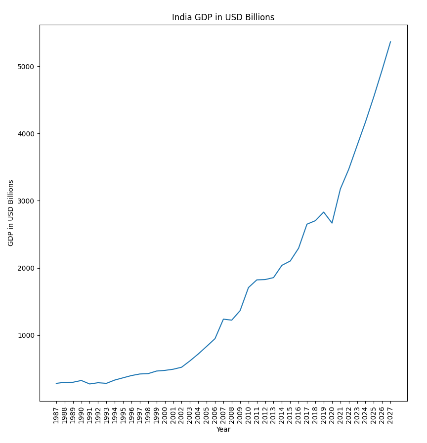
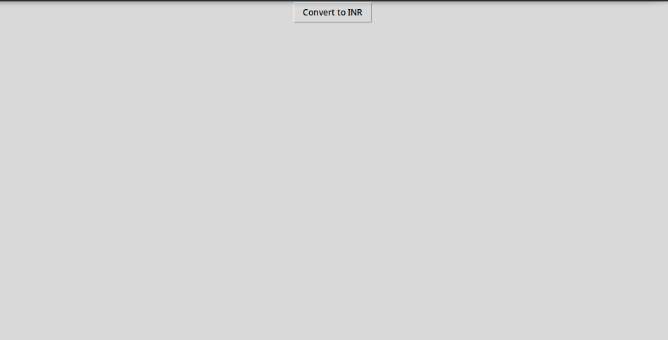
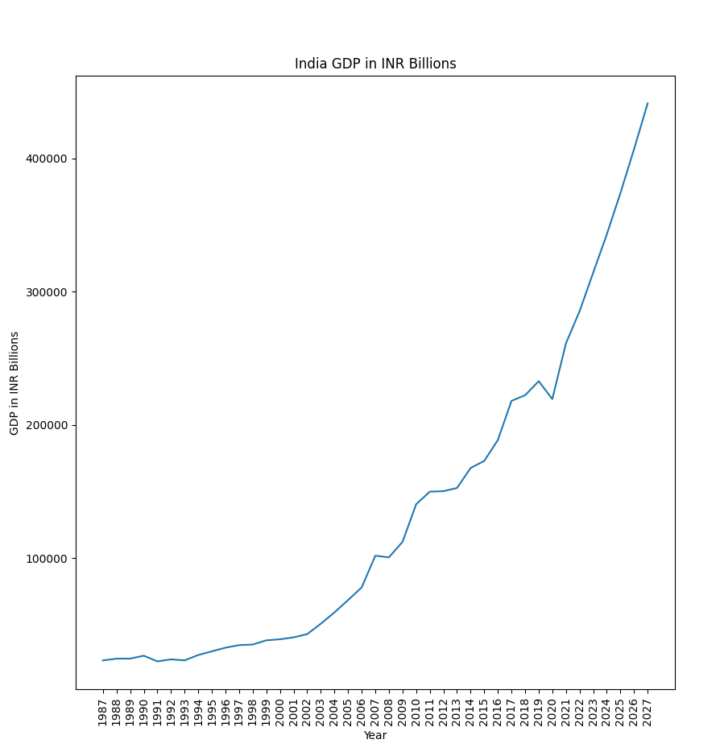

# Assignment Details
- Candidates will visit this [link](https://www.statista.com/statistics/263771/gross-domestic-product-gdp-in-india/) to get the India's GDP figures in USD billions (which is the source data)
- The source data can be stored in a database of their choice (preferably SQL)
- Candidates will recreate the chart available in link of instruction 1 above using Python 
- Candidates will call an API which retrieves USD to INR conversion from any free API's ([example](https://currencyfreaks.com/?msclkid=b1e4e028e9eb12800dd883df892cf1df&utm_source=bing&utm_medium=cpc&utm_campaign=CurrencyFreaks_world_excl_us_eu&utm_term=%2Bcurrency%20%2Bconversion%20%2Bapi&utm_content=CF-API%20kws))
  - We will give higher marks to candidates who call this API. If they face any difficulty, they can manually get the [data from public domain](https://rbi.org.in/scripts/ReferenceRateArchive.aspx) & save it in SQL server for conversion.
- If a consumer of this app clicks conversion factor button in the app, then the GDP numbers in the chart will convert into INR Billion.

## GDP data plotted in USD

## GUI button for USD to INR conversion

## GDP data plotted in INR
